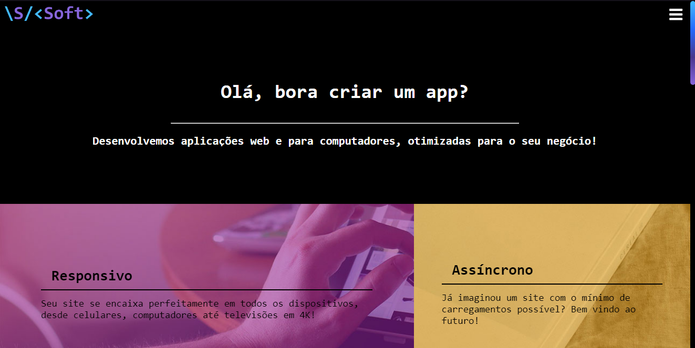
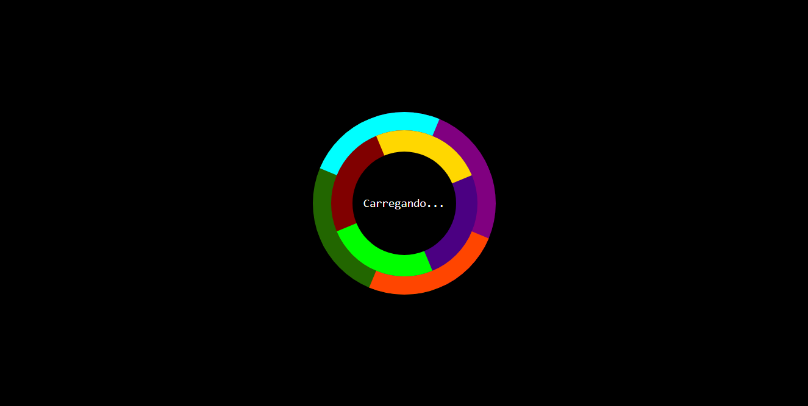

# Visual System Softwares

Screenshot of first view of the main page.

The objective of this project is to make a portfolio to our enterprise.

Our objective is to spread our skills and projects to reach a clientele.

## Technologies used
To make this project where used the technologies bellow:
* Mark Languages
    * HTML5
* Styling Languages
    * CSS3
* Programming Languages
    * JavaScript
* Frameworks
    * [SCSS](https://sass-lang.com/)
    * [Angular.js](https://angularjs.org/)
* Image edition softwares
    * [Photopea](https://www.photopea.com/)

## Slogan: "Your app in foreground"
With this slogan, our objective is to make a word game, showing to our clients that they are our priority, but using a expression that says that the app is in front of everything in the viewport.

## Font family
The font family chosed is <b>Consolas</b>, 'cuz this is the default font family to Notepad, Notepad++ and VisualStudio/VSCode.

The secondary font family chosed is <b>Courier New</b>, for the same reason.

And if (for some kinda reason that even God coudn't explain) the user don't have any of those 2 fonts, then the site will appear with any monotype font installed.

## Color pallet
The primary colors of the page are black and white, to make a biggest contrast.

But we used a lot of other color to bring some life to the project and expand the contrast.

Those colors are:
* To scrollbar (on Chrome and webkit browsers)
    * Pink
    * Purple
    * Red
    * Orange
    * Yellow
    * Gray
* To Loading page
    * Indigo
    * Lime
    * Marron
    * Gold
    * Darkgreen
    * Cyan
    * Purple
    * Orange Red
* To buttons
    * Cyan
    * Magenta
    * Purple
    * Lime
    * Maroon
    * Gold

The loader. (I'll try to make it a GIF to put here)

## The menubar
The menubar only appears as a <i>Hamburger Menu</i>, common on mobiles templates. That means that the site doesn't have the "default" navbar with links side by side, but a navbar that appears only when the user wants.

This saves space in screen and time of development, besides being something different of the commom.

Over it all, the when the menu is show, the page becomes blurry (still working and being scrollable, but blurry), to give the focus to it (menu).

The hamburger menu.

&copy;2020 - All rights reserved
